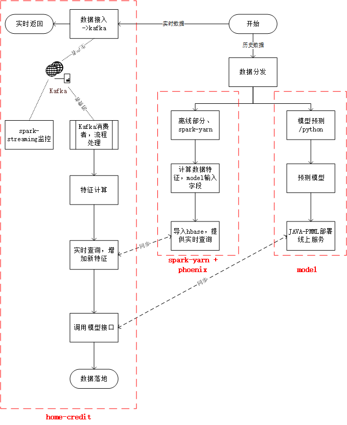
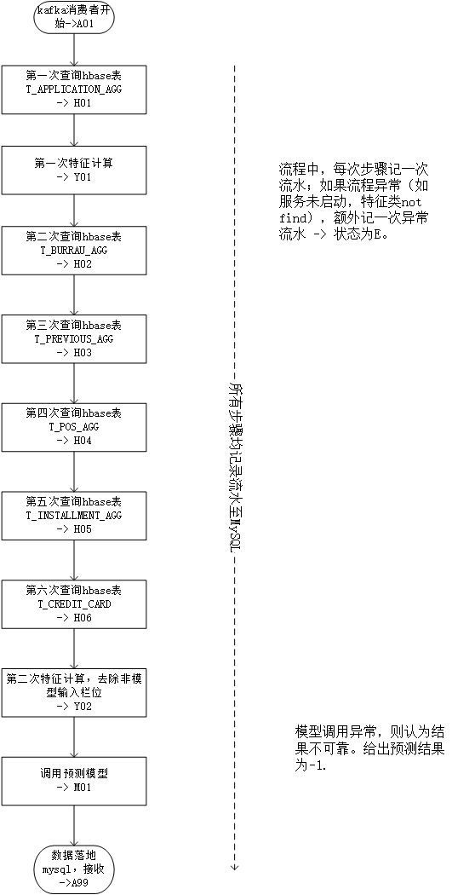

# home-credit
一个基于kaggle数据集[Home Credit Default Risk](https://www.kaggle.com/c/home-credit-default-risk)的线上预测服务<br/>
项目包括以下子服务<br/>
    
1，线上部署机器学习模型，通过将python model文件转换成pmml模型，提供实时预测结果 [model](https://github.com/raoqiangpeter/model)

2，spark-yarn离线数据分析，将原数据进行特征提取，并且入hbase提供实时查询 [sparkyarn](https://github.com/raoqiangpeter/sparkyarn)
    
3，phoenix，一个支持hbase二级索引的标准实时查询接口服务 [phoenix](https://github.com/raoqiangpeter/phoenix)



## Home Credit Default Risk 介绍

kaggle提供的一个贷款审批[数据集](https://www.kaggle.com/c/home-credit-default-risk/data)，通过数据集预测申请者是否能正常支付贷款。<br/>

1, ```application_{train|test}.csv``` 数据集，训练数据和预测数据集；每一条记录代表样本中的一个贷款申请信息。<br/>
2, ```bureau.csv``` 数据集，信用机构统计的所有客户历史申请数据。对于以上贷款申请客户，该数据集可能包含多笔客户以往的申请数据。<br/>
3, ```bureau_balance.csv``` 数据集，信用机构历史贷记月度还款数据。<br/>
4, ```POS_CASH_balance.csv``` 数据集，本公司历史贷记月度还款数据。<br/>
5, ```credit_card_balance.csv``` 数据集，本公司月度信用卡使用情况。<br/>
6, ```previous_application.csv``` 数据集，历史申请数据。<br/>
7, ```installments_payments.csv``` 申请人房屋贷款历史还款数据。<br/>


## 项目流程 介绍

### 应用技术
数据存储：```MySQL```，```hadoop hdfs```，```hbase``` + ```phoenix```<br/>
中间件: ```kafka```, ```spark```, ```spark-streaming```, ```zookeeper```<br/>
后台：```java```, ```python```, ```spring```, ```mybaits```

### 流程
下面介绍kafka消费者处理流程：<br/>
<br/>
1, 数据接入发送至kafka topic -> ```HC00_APPLICATION_SUBMIT```,返回调用方接收数据成功。<br/>
2, kafka消费者对接收申请数据消费，topic存在两个分区；为增加并行性，采用两个消费者对0/1分区消费。<br/>
3, 申请数据预处理(栏位清洗)，主要为必要查询hbase字段，通过清洗的申请数据栏位，第一次查询hbase数据；该部分数据为```application_{train|test}.csv```聚合提取数据。<br/>
4, 数据清洗，针对申请数据进行特征提取。<br/>
5, 第二次查询hbase数据，新增 ```bureau.csv``` + ```bureau_balance.csv```数据提取字段。<br/>
6, 第三次查询hbase数据，新增 ```previous_application.csv```数据提取字段。<br/>
7, 第四次查询hbase数据，新增 ```POS_CASH_balance.csv```数据提取字段。<br/>
8, 第五次查询hbase数据，新增 ```installments_payments.csv```数据提取字段。<br/>
9, 第六次查询hbase数据，新增 ```credit_card_balance.csv```数据提取字段。<br/>
10,第二次数据清洗，特征计算，这里的栏位依赖hbase查询结果。<br/>
11，调用model服务，预测结果，数据落地 -> mysql。
12, spark-streaming 对接入数据进行监测，监测指标为每5秒钟申请量。